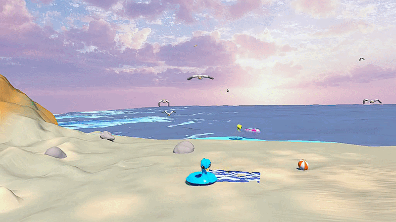
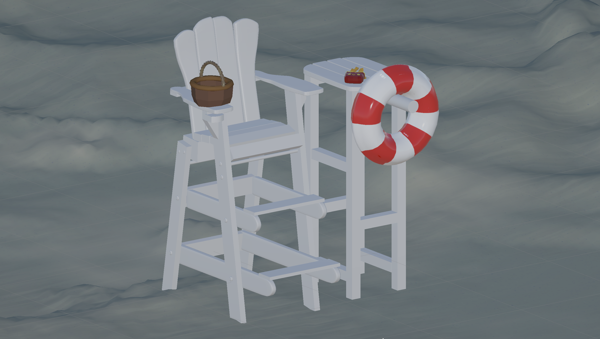
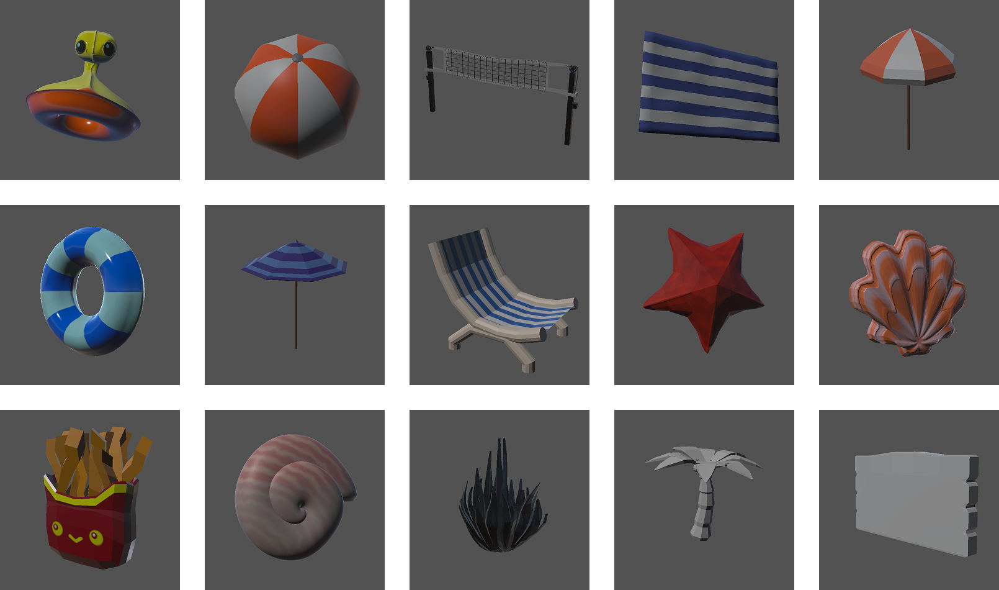
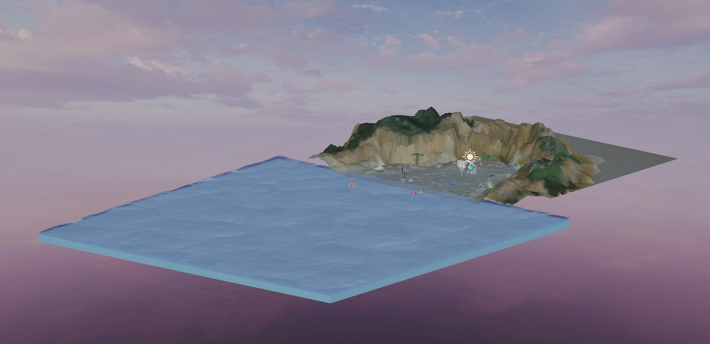

# Fry Away 

*Fry Away* is a VR video game modeled after frisbee golf. The player is a lifeguard on a sunny beach and must throw bread at incoming seagulls to keep them away. The objective is to survive as long as possible before too many seagulls gather nearby. 

    
    </a>

  
  
  

 

It was developed over 5 weeks as a project for the course *53451 Research Issues in Game Development: Designing for XR* at Carnegie Mellon University.

Core elements include: 
- Grab and throw mechanic with realistic frisbee physics  
- Multimodal feedback for throws and hits: visual, audio, and haptic 
- Group and individual seagull behavior 
- Dynamic game-state-based audio 
- Diegetic UI 

# Developers

**Art**: Ada Menger-Thau, Kaycee Stiemke

**Engineering**: Clytie Qiu, Shiyu Zhang, Xiao Yuan

**Production**: Clytie Qiu, Shiyu Zhang

**Sound**: Charles Chen

**UI/UX**: Nina Yu 

# External Asset Usage 
### 3rd Party Assets
[Simple Water Shader URP](https://assetstore.unity.com/packages/2d/textures-materials/water/simple-water-shader-urp-191449) by IgniteCoders 

[AllSky Free - 10 Sky / Skybox Set](https://assetstore.unity.com/packages/2d/textures-materials/sky/allsky-free-10-sky-skybox-set-146014) by rpgwhitelock 

[Koulen](https://fonts.google.com/share?selection.family=Koulen) Font by Danh Hong 

### AI-Generated UI Elements 
Defeated Seagull Icon by ChatGPT (use: Scoreboard UI)

Hungry Seagull Icon by ChatGPT (use: Main Menu UI)

Seagull Head Icon Icon by ChatGPT (use: Settings UI, Warning Sign UI)